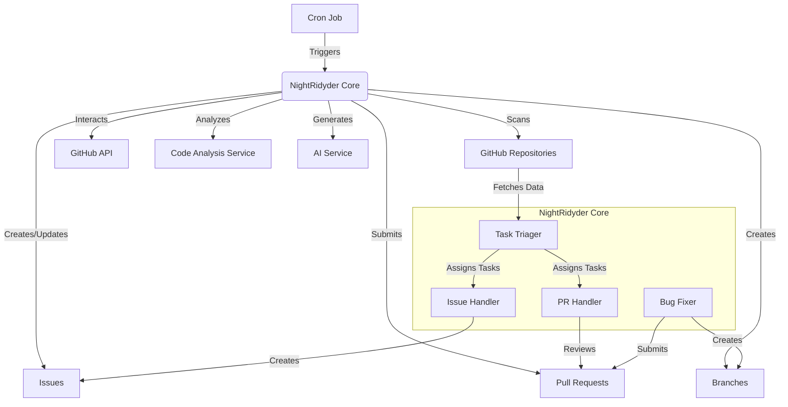

# NightRidyder Technical Design

## Overview

NightRidyder is an autonomous agent that operates on your GitHub repositories during off-hours. It's triggered by a cron job and performs various tasks based on the state of the repositories and assignments.

## Core Functionalities

1. **Repository Crawling**: Scans all accessible repositories for tasks assigned to @ryder.
2. **Task Triage**: Determines if the assigned task is an issue review or requires analysis.
3. **Code Analysis**: Performs deep analysis on repositories to identify potential issues.
4. **Issue Creation**: Generates and assigns new issues based on analysis results.
5. **Bug Fixing**: Creates branches, fixes identified bugs, and submits pull requests.

## System Architecture



## Detailed Component Descriptions

### 1. Cron Job Trigger

- Implemented using GitHub Actions or a separate server with cron capabilities.
- Runs at predefined off-hours (e.g., 1 AM to 5 AM local time).
- Triggers the main NightRidyder process.

### 2. NightRidyder Core

- **Task Triager**:
  - Scans repositories for tasks assigned to @ryder.
  - Categorizes tasks as reviews, issues, or triggers analysis if no specific task.
- **Issue Handler**:
  - Processes existing issues or creates new ones based on analysis.
- **PR Handler**:
  - Reviews assigned pull requests.
  - Creates new pull requests for bug fixes.
- **Bug Fixer**:
  - Analyzes code for potential bugs.
  - Creates branches for fixes.
  - Implements fixes using AI-generated solutions.

### 3. GitHub API Integration

- Uses `@octokit/rest` for TypeScript-friendly GitHub API interactions.
- Handles authentication and rate limiting.

### 4. Code Analysis Service

- Integrates static code analysis tools (e.g., ESLint for TypeScript/JavaScript).
- Identifies code smells, potential bugs, and areas for improvement.

### 5. AI Service Integration

- Utilizes OpenAI's GPT or similar models for:
  - Generating issue descriptions.
  - Suggesting code improvements.
  - Drafting pull request descriptions.

## Implementation Steps

1. **Setup and Authentication**:

   ```typescript
   import { Octokit } from "@octokit/rest";

   const octokit = new Octokit({ auth: process.env.GITHUB_TOKEN });
   ```

2. **Repository Scanning**:

   ```typescript
   async function scanRepositories() {
   	const { data: repos } = await octokit.repos.listForAuthenticatedUser();
   	for (const repo of repos) {
   		await processRepository(repo);
   	}
   }
   ```

3. **Task Triage**:

   ```typescript
   async function processRepository(repo: Repository) {
   	const issues = await getAssignedIssues(repo);
   	const prs = await getAssignedPullRequests(repo);

   	if (issues.length > 0 || prs.length > 0) {
   		await handleAssignedTasks(issues, prs);
   	} else {
   		await performRepositoryAnalysis(repo);
   	}
   }
   ```

4. **Bug Fixing and PR Creation**:

   ```typescript
   async function fixBugAndCreatePR(repo: Repository, bug: Bug) {
   	const branchName = `fix-${bug.id}`;
   	await createBranch(repo, branchName);
   	await implementFix(repo, branchName, bug);`touch
   	await createPullRequest(repo, branchName, bug);
   }
   ```

5. **AI-Assisted Code Improvement**:
   ```typescript
   async function suggestCodeImprovement(code: string) {
   	const improvement = await aiService.improveCode(code);
   	return improvement;
   }
   ```

## Security Considerations

- Use GitHub Apps for fine-grained permissions instead of personal access tokens.
- Implement proper error handling and logging for all API interactions.
- Ensure all created branches, issues, and PRs are clearly labeled as bot-generated.
- Implement safeguards to prevent infinite loops of issue creation or PR submissions.

## Future Enhancements

1. Implement a feedback mechanism for you to quickly approve or reject NightRidyder's suggestions.
2. Add support for multiple AI models to compare suggestions.
3. Implement a learning mechanism to improve code suggestions over time based on accepted/rejected changes.
4. Extend functionality to support multiple Git platforms (GitLab, Bitbucket).
